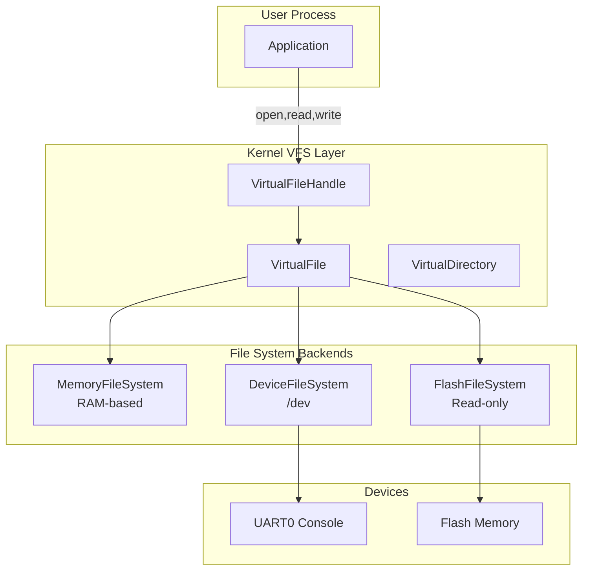
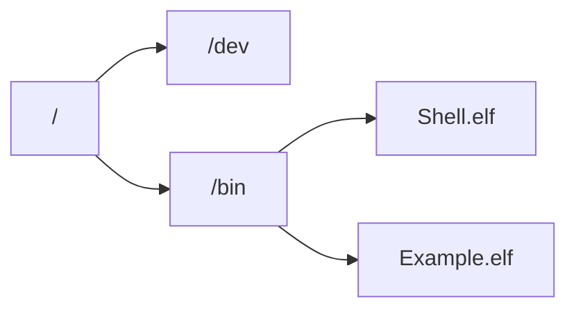
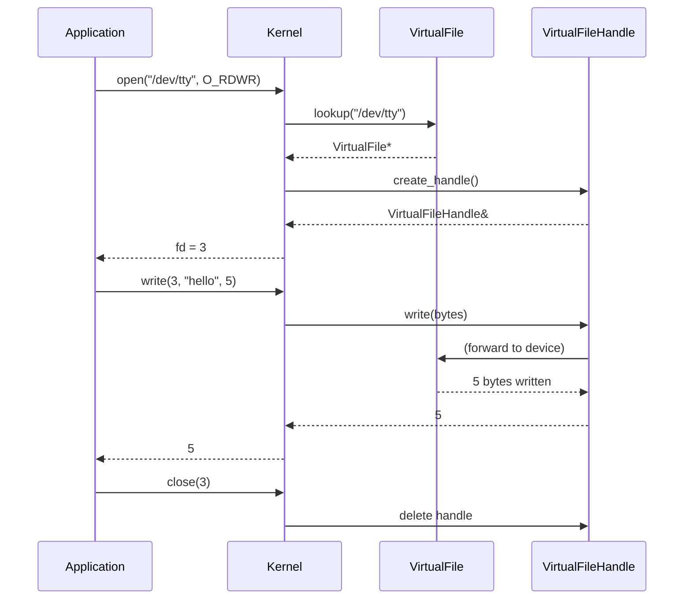

# FileSystem Architecture

PicoOS implements a Virtual File System (VFS) abstraction to support different storage backends.

## Architecture Overview



---

## VFS Components

### VirtualFile
The base class for all file nodes.

| Property | Type | Description |
| :--- | :--- | :--- |
| `m_mode` | `ModeFlags` | Regular, Directory, or Device |
| `m_size` | `u32` | File size in bytes |
| `m_device_id` | `u32` | Device identifier (if device file) |
| `m_ino` | `u32` | Inode number |

### VirtualFileHandle
Represents an open instance of a file used by a process.
- Tracks read/write offsets
- Must be closed to prevent memory leaks
- Each `open()` creates a new handle

### VirtualDirectory
A special `VirtualFile` containing a map of child entries.
```cpp
HashMap<ImmutableString, VirtualFile*> m_entries;
```

---

## File System Implementations

### 1. MemoryFileSystem (TmpFS)



- **Location**: RAM
- **Persistence**: None (lost on reboot)
- **Use Case**: Temporary files, runtime directories

### 2. DeviceFileSystem (`/dev`)

Maps special character devices to file nodes.

| Device | Path | Description |
| :--- | :--- | :--- |
| Console | `/dev/tty` | UART0 input/output |

**Console Implementation**:
- `read()`: Blocks until data available in UART RX FIFO
- `write()`: Sends data to UART TX FIFO

### 3. FlashFileSystem

- **Location**: Flash memory (XIP)
- **Persistence**: Read-only, embedded at build time
- **Generation**: `Tools/ElfEmbed` tool creates embedded ELF sections

**Contents**:
```
/bin/Shell.elf
/bin/Example.elf
/bin/Editor.elf
```

---

## File Operations Flow



---

## Key Files

| File | Description |
| :--- | :--- |
| [VirtualFileSystem.hpp](../../Kernel/FileSystem/VirtualFileSystem.hpp) | Base VFS classes |
| [MemoryFileSystem.cpp](../../Kernel/FileSystem/MemoryFileSystem.cpp) | RAM filesystem |
| [DeviceFileSystem.cpp](../../Kernel/FileSystem/DeviceFileSystem.cpp) | Device node mapping |
| [FlashFileSystem.cpp](../../Kernel/FileSystem/FlashFileSystem.cpp) | Embedded flash files |
| [ConsoleDevice.cpp](../../Kernel/ConsoleDevice.cpp) | TTY implementation |

---

## Known Limitations

- No subdirectory creation at runtime
- No file deletion support
- Flash filesystem is read-only
- Limited error reporting
