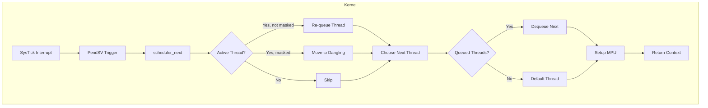

# Scheduler Architecture

The PicoOS scheduler is a **preemptive, round-robin** scheduler designed for the RP2040's dual-core Cortex-M0+.

## Overview



---

## Key Components

### Thread States

| State | Description |
| :--- | :--- |
| **Queued** | Ready to run, waiting in `m_queued_threads` |
| **Active** | Currently executing (`m_active_thread`) |
| **Masked** | Blocked, won't be scheduled (`m_masked_from_scheduler = true`) |
| **Dangling** | Awaiting cleanup (last reference) |

### Thread Queues

```cpp
CircularQueue<RefPtr<Thread>, 16> m_queued_threads;   // Ready threads
CircularQueue<RefPtr<Thread>, 16> m_dangling_threads; // Awaiting destruction
RefPtr<Thread> m_active_thread;                       // Currently running
```

---

## Scheduling Algorithm

1. **Timer Interrupt** (SysTick): Fires periodically based on `systick_hw->rvr`.
2. **PendSV Set**: `isr_systick()` sets the PendSV pending bit.
3. **Context Switch**: `scheduler_next()` is invoked by PendSV handler.
4. **Save Context**: Active thread's registers are stashed.
5. **Choose Next**:
   - If dangling threads need cleanup → run default thread
   - If queue is empty → run default thread
   - Otherwise → dequeue next thread
6. **Restore Context**: Load new thread's registers, return from exception.

---

## Special Threads

### Default Thread
A kernel thread that runs when no other work is available. Its job:
- Clean up dangling threads (drop last reference)
- Immediately trigger reschedule

### Fallback Thread
A simpler backup that runs if the default thread is blocked (e.g., waiting on a mutex).

### Dummy Thread
Used only during boot to enter the scheduler for the first time.

---

## Preemption

Preemption is **timer-based** via SysTick:
- **Normal Mode**: `systick_hw->rvr = 0x000f0000` (~1ms at 125MHz)
- **Slow Mode**: `systick_hw->rvr = 0x00f00000` (~16ms, for debugging)

Threads can also **yield voluntarily**:
```cpp
Scheduler::the().trigger();
```

---

## Memory Protection

Before returning to userland, the scheduler configures the MPU:

```cpp
setup_mpu(m_active_thread->m_regions);
```

Each thread has a list of `MPU::Region` entries defining:
- Kernel Flash (read-only, execute)
- User RAM (read-write, no execute)
- ROM tables (read-only)

---

## Privilege Levels

The scheduler sets the `CONTROL` register based on thread type:

| Thread Type | CONTROL | Privilege |
| :--- | :---: | :--- |
| Kernel (`m_privileged = true`) | `0b10` | Privileged (full access) |
| Userland (`m_privileged = false`) | `0b11` | Unprivileged (MPU enforced) |

---

## Initialization Flow

```mermaid
sequenceDiagram
    participant main as main()
    participant loop as Scheduler::loop()
    participant dummy as Dummy Thread
    participant sched as scheduler_next()

    main->>loop: Call loop()
    loop->>loop: Create default_thread
    loop->>loop: Create fallback_thread
    loop->>dummy: Create dummy_thread
    loop->>dummy: Set as active
    loop->>dummy: Restore context
    dummy->>dummy: Enable mutexes
    dummy->>sched: trigger()
    sched->>sched: Mark dummy as masked
    sched->>sched: Schedule first real thread
```

---

## Key Files

| File | Purpose |
| :--- | :--- |
| [Scheduler.hpp](../../Kernel/Threads/Scheduler.hpp) | Class definition |
| [Scheduler.cpp](../../Kernel/Threads/Scheduler.cpp) | Implementation |
| [Thread.hpp](../../Kernel/Threads/Thread.hpp) | Thread class |
| [Context.S](../../Kernel/Context.S) | Assembly context switch |
