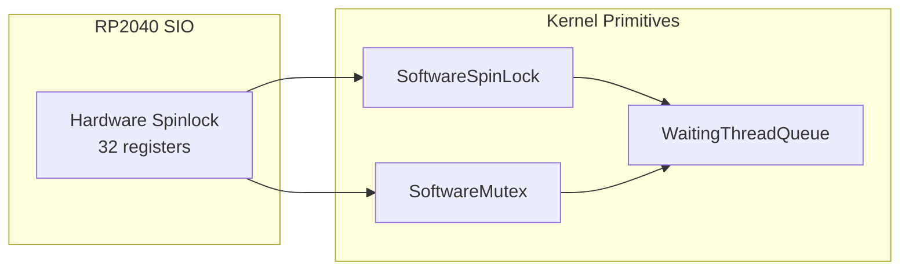
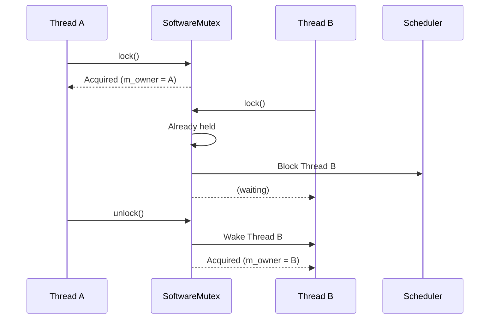

# Synchronization Primitives

As of v0.3.1, PicoOS includes a suite of synchronization primitives designed for multi-core (SMP) safety on the RP2040.

## Overview



The RP2040 has two cores (Core 0 and Core 1). To support SMP scheduling safely, we use hardware-backed locking mechanisms.

---

## 🔒 HardwareSpinLock

A wrapper around the RP2040's hardware spinlock peripheral (`SIO`).

| Property | Value |
| :--- | :--- |
| **Hardware Support** | 32 atomic spinlock registers |
| **Address Base** | `0xD0000100` |
| **Power Optimization** | `wfe`/`sev` instructions |

### Lock Acquisition Flow

```mermaid
flowchart TD
    A[lock()] --> B[Disable Interrupts]
    B --> C{Read spinlock reg}
    C -->|Non-zero| D[Got lock! ✓]
    C -->|Zero| E[wfe - sleep]
    E --> C
    D --> F[Memory Barrier]
    F --> G[Return]
```

### Usage
```cpp
HardwareSpinLock lock((volatile u32*)0xD0000100);
lock.lock();
// Critical section
lock.unlock();
```

---

## 🌀 SoftwareSpinLock

A scalable spinlock that allows more locks than the 32 hardware slots.

| Property | Value |
| :--- | :--- |
| **Internal State** | `m_locked` boolean + `m_owning_core` |
| **Protection** | Shared `HardwareSpinLock` |
| **Deadlock Detection** | Panics if same core re-locks |

### How It Works

1. Acquires the shared hardware lock
2. Checks if `m_locked == false`
3. If yes: sets `m_locked = true`, records core ID, releases hw lock
4. If no: releases hw lock, calls `wfe`, retries

### Usage
```cpp
// Initialize once at boot
static HardwareSpinLock s_shared_hw_lock((volatile u32*)0xD0000100);
SoftwareSpinLock::initialize(s_shared_hw_lock);

// In code (interrupts MUST be disabled)
SoftwareSpinLock my_lock;
{
    MaskedInterruptGuard guard;  // Disables interrupts
    my_lock.lock();

    // Critical section

    my_lock.unlock();
}
```

> [!WARNING]
> Calling `lock()` with interrupts enabled will trigger an assertion failure.

---

## 🛑 SoftwareMutex

A blocking synchronization primitive for higher-level kernel usage.

| Property | Value |
| :--- | :--- |
| **Behavior** | Blocks (yields to scheduler) |
| **Waiting Queue** | `CircularQueue<Thread*, 16>` |
| **Owning Thread** | Tracked via `m_owner` |

### Lock/Unlock Flow



### Usage
```cpp
SoftwareMutex mutex;
mutex.initialize(some_hw_spinlock);

mutex.lock();
// Protected resource access
mutex.unlock();
```

> [!IMPORTANT]
> Interrupts **MUST be enabled** when using `SoftwareMutex`. It blocks the thread, which requires the scheduler.

---

## 🚦 WaitingThreadQueue

A helper class to manage lists of blocked threads.

- **Thread Safety**: Protected by injected `HardwareSpinLock`
- **Capacity**: Up to 32 waiting threads
- **Operations**: `enqueue()`, `dequeue()`, `is_empty()`

---

## Global Locks

Defined and initialized in [Kernel/main.cpp](../../Kernel/main.cpp):

| Lock | Purpose | Type |
| :--- | :--- | :--- |
| `malloc_mutex` | Global heap allocator | `SoftwareMutex` |
| `page_allocator_mutex` | Physical page allocation | `SoftwareMutex` |
| `dbgln_mutex` | Serial output (prevents interleave) | `SoftwareMutex` |

---

## Comparison Table

| Primitive | Blocking | Interrupts | Use Case |
| :--- | :---: | :---: | :--- |
| `HardwareSpinLock` | No (spins) | Disabled | Low-level, inter-core |
| `SoftwareSpinLock` | No (spins) | Disabled | Short critical sections |
| `SoftwareMutex` | Yes (yields) | Enabled | I/O, allocators, longer holds |

---

## Key Files

| File | Description |
| :--- | :--- |
| [HardwareSpinLock.hpp](../../Kernel/Synchronization/HardwareSpinLock.hpp) | Raw hardware lock wrapper |
| [SoftwareSpinLock.cpp](../../Kernel/Synchronization/SoftwareSpinLock.cpp) | Scalable spinlock with deadlock detection |
| [SoftwareMutex.cpp](../../Kernel/Synchronization/SoftwareMutex.cpp) | Blocking mutex implementation |
| [WaitingThreadQueue.cpp](../../Kernel/Synchronization/WaitingThreadQueue.cpp) | Thread queue management |
