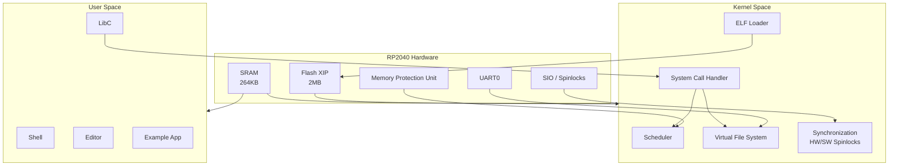
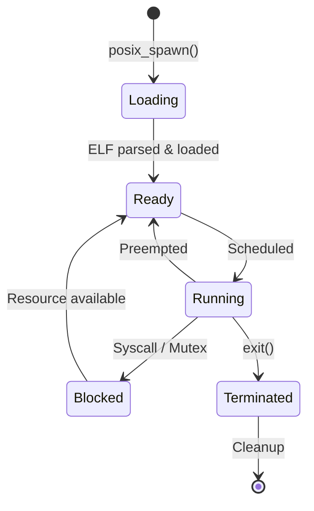

# System Overview

PicoOS is a microkernel-inspired simple OS for the memory-constrained RP2040 microcontroller.

## Architecture Diagram

---

## Memory Model

The RP2040 (Cortex-M0+) lacks a Memory Management Unit (MMU), meaning there is no virtual memory pagination in the traditional sense. All addresses are physical.

### Memory Map

| Region | Address Range | Size | Usage |
| :--- | :--- | :--- | :--- |
| Flash (XIP) | `0x10000000 - 0x101FFFFF` | 2 MB | Kernel code, embedded files |
| SRAM | `0x20000000 - 0x20041FFF` | 264 KB | Kernel heap, user processes |
| ROM | `0x00000000 - 0x00004000` | 16 KB | RP2040 bootrom |
| Peripherals | `0x40000000+` | - | UART, SPI, GPIO, etc. |

### Kernel Space
*   Resides in Flash (XIP) and specific RAM regions.
*   Runs in **Handler Mode** (interrupts) or Privileged **Thread Mode**.
*   Has full access to all hardware.

### Userland
*   Processes are loaded into RAM.
*   Runs in Unprivileged **Thread Mode**.
*   **Isolation**: Since there is no MMU, we use the ARM v6-M **MPU** (Memory Protection Unit) to protect kernel memory from user access.
*   User stacks are aligned to 8 bytes.

---

## Process Lifecycle

---

## Process Management

*   **Scheduler**: Round-robin scheduler with preemption via SysTick. See [Scheduler Architecture](scheduler.md).
*   **Context Switching**: Saved/Restored via `PendSV` exception.
*   **Loading**: ELF executables are parsed by the kernel.
    *   `FlashFile` executables are mapped directly (XIP) or copied to RAM depending on section type.

---

## Key Subsystems

| Subsystem | Description | Documentation |
| :--- | :--- | :--- |
| Scheduler | Thread management and context switching | [scheduler.md](scheduler.md) |
| Synchronization | Multi-core locking primitives | [synchronization.md](synchronization.md) |
| FileSystem | VFS, DeviceFS, FlashFS | [filesystem.md](filesystem.md) |
| System Calls | User/Kernel interface | [syscalls.md](../reference/syscalls.md) |

---

## Limitations

- **No Virtual Memory**: Swapping not possible.
- **No dynamic linking**: Statically linked ELF only.
- **Crash in Kernel = System Panic**.
- **Single address space**: All processes share physical memory (isolated by MPU).
