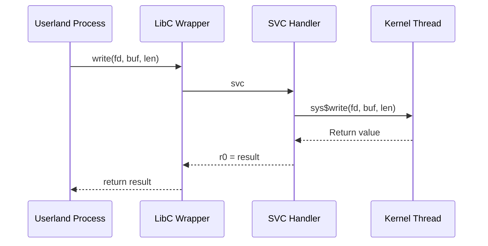

# System Calls

PicoOS communicates with the kernel via `svc` (Supervisor Call) instructions. The C library (`LibC`) wraps these into standard POSIX-like functions.

## Overview



---

## Implemented Syscalls

| Syscall | ID | Signature | Description |
| :--- | :---: | :--- | :--- |
| `exit` | 1 | `void exit(int status)` | Terminate the current process with status code. |
| `read` | 3 | `ssize_t read(int fd, void *buf, size_t count)` | Read up to `count` bytes from file descriptor into buffer. |
| `write` | 4 | `ssize_t write(int fd, const void *buf, size_t count)` | Write `count` bytes from buffer to file descriptor. |
| `open` | 5 | `int open(const char *path, int flags, mode_t mode)` | Open or create a file. Returns file descriptor. |
| `close` | 6 | `int close(int fd)` | Close an open file descriptor. |
| `wait` | 7 | `pid_t wait(int *wstatus)` | Wait for any child process to terminate. |
| `chdir` | 12 | `int chdir(const char *path)` | Change current working directory. |
| `fstat` | 28 | `int fstat(int fd, struct stat *statbuf)` | Get file status by file descriptor. |
| `get_working_directory` | 200 | `int getcwd(char *buf, size_t size)` | Get current working directory path. |
| `posix_spawn` | 201 | `int posix_spawn(pid_t *pid, const char *path, ...)` | Spawn a new process from an ELF file. |

---

## Detailed Examples

### Reading from a File

```c
#include <fcntl.h>
#include <unistd.h>
#include <stdio.h>

int main() {
    char buffer[128];
    int fd = open("/test.txt", O_RDONLY);
    if (fd < 0) {
        printf("Failed to open file\n");
        return 1;
    }

    ssize_t nread = read(fd, buffer, sizeof(buffer) - 1);
    if (nread > 0) {
        buffer[nread] = '\0';
        printf("Read %d bytes: %s\n", (int)nread, buffer);
    }

    close(fd);
    return 0;
}
```

### Writing to TTY

```c
#include <fcntl.h>
#include <string.h>

int main() {
    int fd = open("/dev/tty", O_WRONLY);
    const char *msg = "Hello from PicoOS!\n";
    write(fd, msg, strlen(msg));
    close(fd);
    return 0;
}
```

### Creating a File

```c
#include <fcntl.h>
#include <sys/stat.h>

int main() {
    // O_CREAT creates the file if it doesn't exist
    // Permissions: rw-r--r--
    int fd = open("/newfile.txt", O_WRONLY | O_CREAT, S_IRUSR | S_IWUSR | S_IRGRP | S_IROTH);
    if (fd >= 0) {
        write(fd, "New content\n", 12);
        close(fd);
    }
    return 0;
}
```

### Spawning a Child Process

```c
#include <spawn.h>
#include <sys/wait.h>
#include <stdio.h>

int main() {
    pid_t child_pid;
    char *argv[] = { "/bin/Example.elf", "arg1", "arg2", NULL };
    char *envp[] = { "PATH=/bin", NULL };

    int result = posix_spawn(&child_pid, "/bin/Example.elf", NULL, NULL, argv, envp);
    if (result == 0) {
        printf("Spawned child PID: %d\n", child_pid);

        int status;
        wait(&status);  // Wait for child to finish
        printf("Child exited with status: %d\n", status);
    }
    return 0;
}
```

### Getting Current Directory

```c
#include <unistd.h>
#include <stdio.h>

int main() {
    char *cwd = get_current_dir_name();
    if (cwd) {
        printf("Current directory: %s\n", cwd);
        free(cwd);
    }
    return 0;
}
```

### Changing Directory

```c
#include <unistd.h>
#include <stdio.h>

int main() {
    if (chdir("/bin") == 0) {
        printf("Changed to /bin\n");
    } else {
        printf("chdir failed\n");
    }
    return 0;
}
```

---

## Error Handling

Syscalls return negative values on error. The `errno` global variable is set accordingly:

| Error | Value | Description |
| :--- | :---: | :--- |
| `ENOENT` | 2 | No such file or directory |
| `ENOTDIR` | 20 | Not a directory |
| `EISDIR` | 21 | Is a directory (when writing) |
| `EACCES` | 13 | Permission denied |
| `ERANGE` | 34 | Result out of range |

```c
#include <errno.h>
#include <string.h>
#include <stdio.h>

int fd = open("/nonexistent", O_RDONLY);
if (fd < 0) {
    printf("Error: %s\n", strerror(errno));  // "No such file or directory"
}
```

---

## Low-Level Syscall Interface

For direct syscall access (bypassing LibC):

```c
#include <sys/system.h>

// Direct syscall wrappers
ssize_t sys$read(int fd, void *buf, size_t count);
ssize_t sys$write(int fd, const void *buf, size_t count);
int sys$open(const char *path, int flags, int mode);
int sys$close(int fd);
void sys$exit(int status);
```
